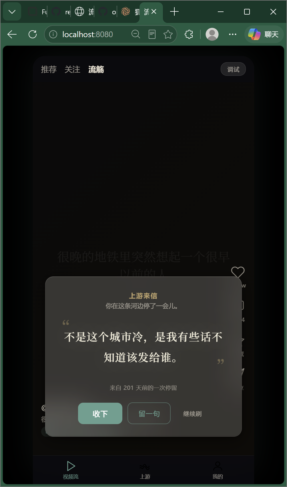

# 流觞

> 刷视频时，AI 把你此刻的情绪，和某个陌生人过去留下的一句话，对上了。

<p align="center">
  
</p>

## 这是什么

「流觞」是一个 AI 短视频卡片体验。当用户在某类内容上停留时，AI 会把视频内容、用户此刻的停留状态和陌生人过去留下的回响句匹配起来，生成一张自然浮现的流觞卡。

它不是评论区，也不是社交群。它更像一只从上游漂来的杯盏：有人曾经留下了一句话，而你刚好刷到了。

## 快速体验

```bash
cd frontend
python -m http.server 8080
# 浏览器打开 http://localhost:8080
```

1. 连续刷 2 个同主题视频（如归乡）
2. 在第 2 个视频停留 8 秒以上
3. 流觞卡从底部漂入
4. 点击「收下」或「留一句」

## 核心体验

- **视频流** — 类抖音竖屏信息流，10 个预设视频覆盖 5 个情绪主题
- **流觞卡** — 半透明纸笺从底部漂入，展示一句陌生人的回响
- **上游页** — 主题封存档案，查看同一主题下的所有回响
- **我的页** — 收下的话、留过的话、漂过的河
- **调试面板** — 实时展示 AI 标签、停留秒数、触发置信度

## 项目结构

```
liushang/
├── frontend/
│   └── index.html          # 单文件原型（Vue 3 CDN）
├── docs/
│   ├── 01-project-proposal.md      # 项目方案
│   ├── 02-ai-skill-prompts.md      # AI 提示词 Skill 设计
│   ├── 03-product-packaging.md     # 产品包装与路演叙事
│   └── superpowers/
│       ├── specs/                  # UI 设计 Spec
│       └── plans/                  # 实现计划
├── openspec/               # OpenSpec 变更管理
└── preview.png             # 效果预览
```

## 流觞卡 UI 设计

### 视觉结构

```
┌─────────────────────────────────┐
│                                 │  ← 半透明毛玻璃纸笺 (18% 米白)
│   上游来信                       │  ← 签名层  13px 金色 600 加字间距
│   你在这条河边停了一会儿。         │  ← 引导层  12px 灰色
│                                 │
│   ┌─ 装饰引号 ─┐               │
│   │             │               │
│   │   回响句     │               │  ← 核心层  21px 衬线加粗
│   │   居中       │               │     米白 + 柔光晕 + 金色弯引号装饰
│   │   大呼吸空间  │               │
│   │             │               │
│   └─────────────┘               │
│                                 │
│   来自 127 天前的一次停留         │  ← 注释层  11px 灰色 退让
│                                 │
│   ─── 22px 间距分隔 ───          │
│                                 │
│   [  收下  ] [ 留一句 ] 继续刷   │  ← 操作层  三级按钮权重递减
│     实底       半透明描边  纯文字  │     15px / 14px / 12px
└─────────────────────────────────┘
```

### 配色

| 元素 | 颜色 | 用途 |
|------|------|------|
| 纸笺背景 | `rgba(245,240,230, 0.18)` + blur(24px) | 米白毛玻璃通透感 |
| 纸笺边缘 | `1px solid rgba(245,240,230, 0.12)` | 纸边，不融化进视频 |
| 回响句文字 | `#f0ead8` + text-shadow 暖光晕 | 被照亮的视觉中心 |
| 装饰引号/标题 | `#d4b478` 金色 35%/85% | 书札题签感 |
| 来源行 | `--ink-secondary` 灰色 85% | 最弱存在感 |
| 主按钮 | `#5a9e8f` 青绿实底 | 唯一行动号召 |

### 字体层级

| 层级 | 字号 | 字重 | 字间距 | 字体 |
|------|------|------|--------|------|
| 签名 | 13px | 600 | 0.08em | 无衬线 |
| 引导 | 12px | 400 | 0.02em | 无衬线 |
| **回响句** | **21px** | **600** | **0.05em** | **衬线 Noto Serif SC** |
| 注释 | 11px | 400 | 0.04em | 无衬线 |
| 主操作 | 15px | 500 | — | 无衬线 |

### 动效

```
光晕预告        卡片上浮           回响句揭幕
(0-800ms)      (800-1700ms)      (1300-2700ms)
  ~~~~            ┌──────┐          从左向右
  径向渐变脉冲 →   │ 上浮  │    →     clip-path 擦除
                  └──────┘          衬线文字流淌

缓动: cubic-bezier(0.16, 1, 0.3, 1) — 破水而出
消失: cubic-bezier(0.55, 0, 0.55, 0.73) — 柔和下沉
```

### 交互反馈

| 动作 | 反馈 |
|------|------|
| 收下 | 卡片闪光 → 缩小上飘 → 青色光点飞向 Tab 角标 → 角标弹跳 |
| 留一句 | 按钮区淡出上移 → 输入区展开 → 聚焦青绿光环 |
| 继续刷 | 卡片下沉淡出 → 5 秒冷却期 |
| 按钮悬停 | 收下: 变深+阴影 / 留一句: 浅色填充 / 继续刷: 下划线展开 |
| 按钮按压 | scale(0.95) 缩放，80ms 响应 |

### 设计原则

1. **回响句是唯一的视觉中心** — 其他元素都在退让
2. **克制不煽情** — 金色只出现在标题和引号装饰上
3. **纸笺不是弹窗** — 半透明毛玻璃，从底部漂入不是弹出
4. **信息与操作分离** — 22px 间距把"读"和"做"分成两个区域

## 设计体系（全局）

水墨纸笺视觉基调：

- 深色视频背景 + 半透明毛玻璃纸笺卡片
- 青绿水痕（`#5a9e8f`）+ 暖金点缀（`#d4b478`）
- 回响句用衬线体（Noto Serif SC），UI 文字用无衬线
- 卡片从底部漂入，三阶段浮现（光晕→卡片→回响句揭幕）

## 技术栈

- Vue 3 CDN + CSS Custom Properties
- 单文件 HTML 原型，后续转 React + Vite 工程

## License

MIT
